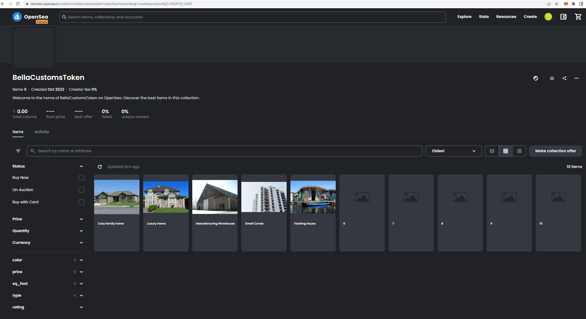

# Udacity Blockchain Capstone

The capstone will build upon the knowledge you have gained in the course in order to build a decentralized housing product. 

# Instructions

* Install node dependencies: `npm install`
* Compile the Solidity smart contracts: `truffle compile`
* Deploy smart contract locally (local blockchain using Ganache) : `truffle migrate --reset`
* Run mocha tests (local blockchain using Ganache): `truffle test`
* Deploy smart contract on Goerli Testnet: `truffle migrate --reset --network goerli` (Cf. deployment configuration in `truffle-config.js`)
* Mint tokens: node mint.js

# Contract deployment on Goerli

* Goerli Etherscan: https://goerli.etherscan.io/address/0xb71bcf00246d957babb0be9c5ba9455d033b4ba7
* Account: 0xB71bcF00246D957Babb0BE9C5bA9455D033B4BA7
* Contract Address: https://goerli.etherscan.io/address/0x47b490610d19dc14489f0d57d712036e4f520c8e
* SolnSquareVerifier Tx Hash: https://goerli.etherscan.io/tx/0x5db6ba92fe40aa47f330ebbf2a604c290c2919af50231000db919bdb827eb85e
* Verifier Tx Hash: https://goerli.etherscan.io/tx/0xed60889f430618e392a41afba239bf37f3525ad2ff2d78d867bf5a0ae4c49663
* OpenSea : https://testnets.opensea.io/0xB71bcF00246D957Babb0BE9C5bA9455D033B4BA7
* OpenSea - Created: https://testnets.opensea.io/MyMMTest?tab=created

# Minted Tokens and showing 10 properties in Marketplace

* 0xe16279e343f8f14b194cbec37637707510ff58aef078e994c9db88098d43ec7b
* 0x1796df7c24ec39fa9f955eecd88749e603a2340fde702d6ae48742a16dc3ea77
* 0xcc9aead232f131af0de590d263d06091e5aec164e39a0e276846a699f9792ab7
* 0x01e1bea4dfda6e39e5f42e0fa2661f9d005b5f660a60e2194ecd9a40c71b3528
* 0xc50c723baa0fca05769ad112306c9317e58eaa42350e7a6e4a102efa11047ad7
* 0x832270ad105bdf25cb27769861ae27eff736297f84d40a3d6a3bdb2aaa57acbc
* 0x44018337abb733aadfb776bfdd9b27d18ee068e14c12e69cb6ce919f09c678d9
* 0x7a92ae7c6d7d2399c31a30d1b8d961bcb25912d813a2b28e658c301b3720d5fc
* 0xbda61f2e41bd4d4618c1ab8095aae887507b80d1542a78adb769683a20b56d03
* 0x1139cb56e52c2374d27e12b942804e2d4dca1ed6a5af57360c9f6a58d2c8cbb4

# Project Resources

* [Remix - Solidity IDE](https://remix.ethereum.org/)
* [Visual Studio Code](https://code.visualstudio.com/)
* [Truffle Framework](https://truffleframework.com/)
* [Ganache - One Click Blockchain](https://truffleframework.com/ganache)
* [Open Zeppelin ](https://openzeppelin.org/)
* [Interactive zero knowledge 3-colorability demonstration](http://web.mit.edu/~ezyang/Public/graph/svg.html)
* [Docker](https://docs.docker.com/install/)
* [ZoKrates](https://github.com/Zokrates/ZoKrates)
